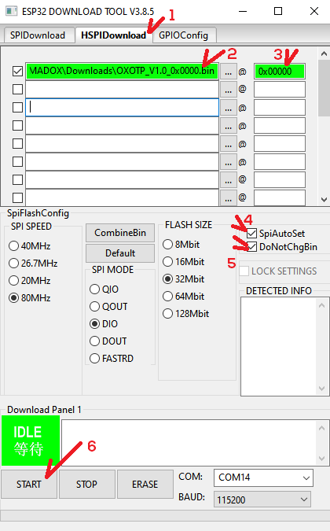

# HOW TO FLASH M5StickC

1. DOWNLOAD <a href="https://www.espressif.com/sites/default/files/tools/flash_download_tool_v3.8.5.zip" target="_blank">Flash Download Tool</a> 
2. DOWNLOAD Last Release <a href="https://github.com/IMSHOX/OXOTP/releases/download/1.0/OXOTP_V1.0_0x0000.bin" target="_blank">HERE</a> 
3. Open Flash Download Tool 
4. 

5. 

6. 

### Restart your M5StickC after the flash is finished and enjoy it
