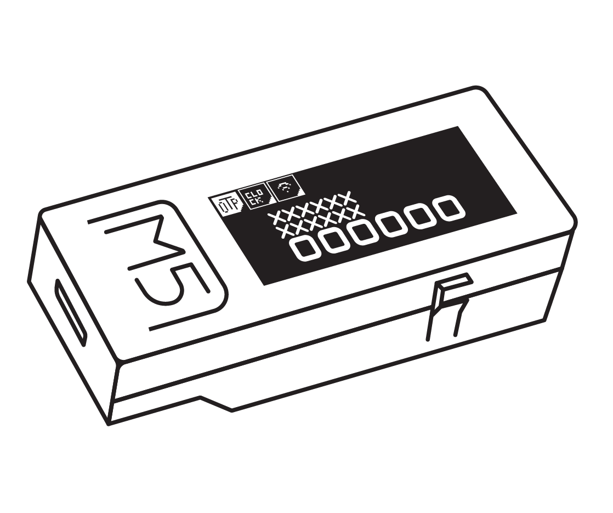

# M5stickC OXOTP

<b>FIRST OTP BASED ON ESP32 BOARD   

  Click <a href="">here</a> for the .bin files.  

Or become a patron on <a href="https://patreon.com/IMSHOX" target="_blank">PATREON.COM/IMSHOX</a>. 

## [📟 Binaries]()
## [📖 Wiki]()
## [📱 PLAYSTORE](https://play.google.com/store/apps/details?id=com.shox.oxotp)
app used to config the OXOTP 

## WHY M5StickC ?
The M5StickC is a compact device with screen, battery and RTC build in with a cheap price.

Less than 10 dollar M5StickC will make huge difference in quality/price with others OTPs 

## HOW TO USE

DOWNLOAD THE APP FROM PLAY STORE 

picture 1
picture 2 
picture 3
picture 4

## License 

This software is licensed under the MIT License. 

Copyright (c) 2020 Imad Mezghache
 
Permission is hereby granted, free of charge, to any person obtaining a copy of this software and associated documentation files (the "Software"), to deal in the Software without restriction, including without limitation the rights to use, copy, modify, merge, publish, distribute, sublicense, and/or sell copies of the Software, and to permit persons to whom the Software is furnished to do so, subject to the following conditions:

The above copyright notice and this permission notice shall be included in all copies or substantial portions of the Software.

THE SOFTWARE IS PROVIDED "AS IS", WITHOUT WARRANTY OF ANY KIND, EXPRESS OR IMPLIED, INCLUDING BUT NOT LIMITED TO THE WARRANTIES OF MERCHANTABILITY, FITNESS FOR A PARTICULAR PURPOSE AND NONINFRINGEMENT. IN NO EVENT SHALL THE AUTHORS OR COPYRIGHT HOLDERS BE LIABLE FOR ANY CLAIM, DAMAGES OR OTHER LIABILITY, WHETHER IN AN ACTION OF CONTRACT, TORT OR OTHERWISE, ARISING FROM, OUT OF OR IN CONNECTION WITH THE SOFTWARE OR THE USE OR OTHER DEALINGS IN THE SOFTWARE.
