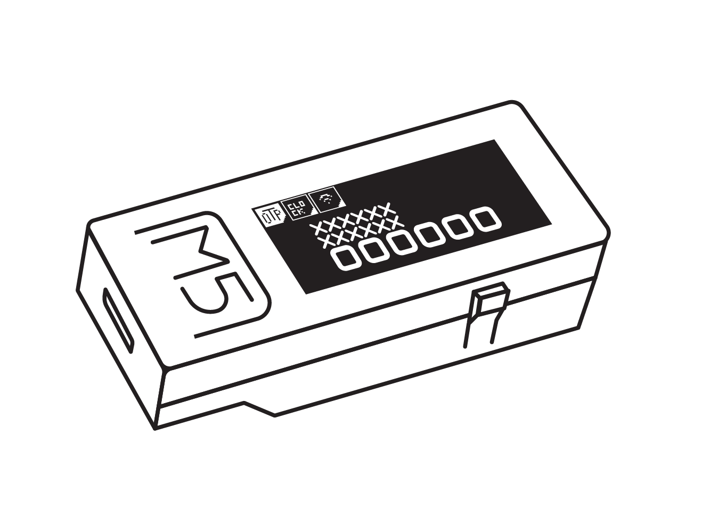
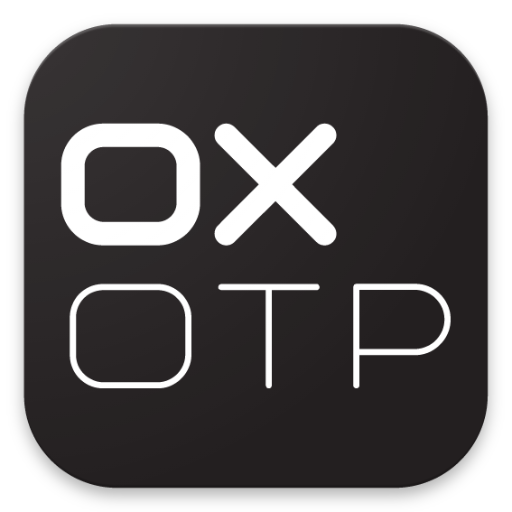
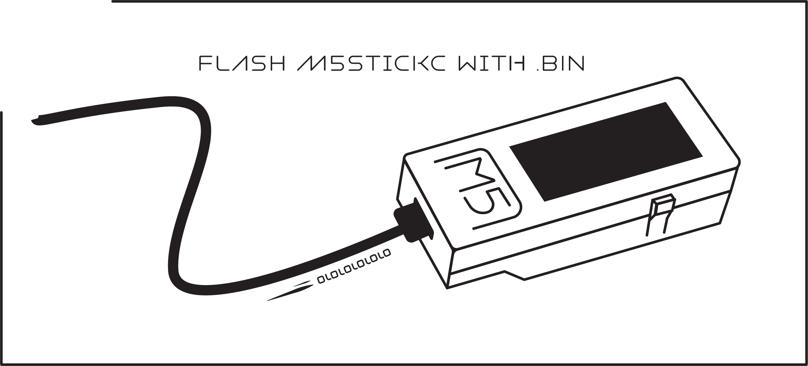
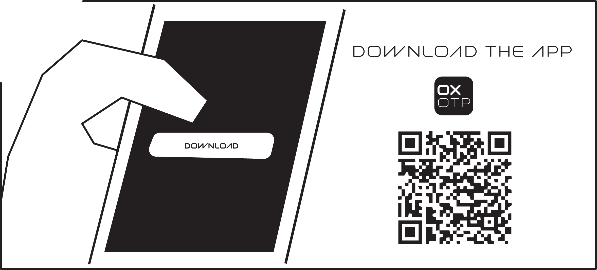
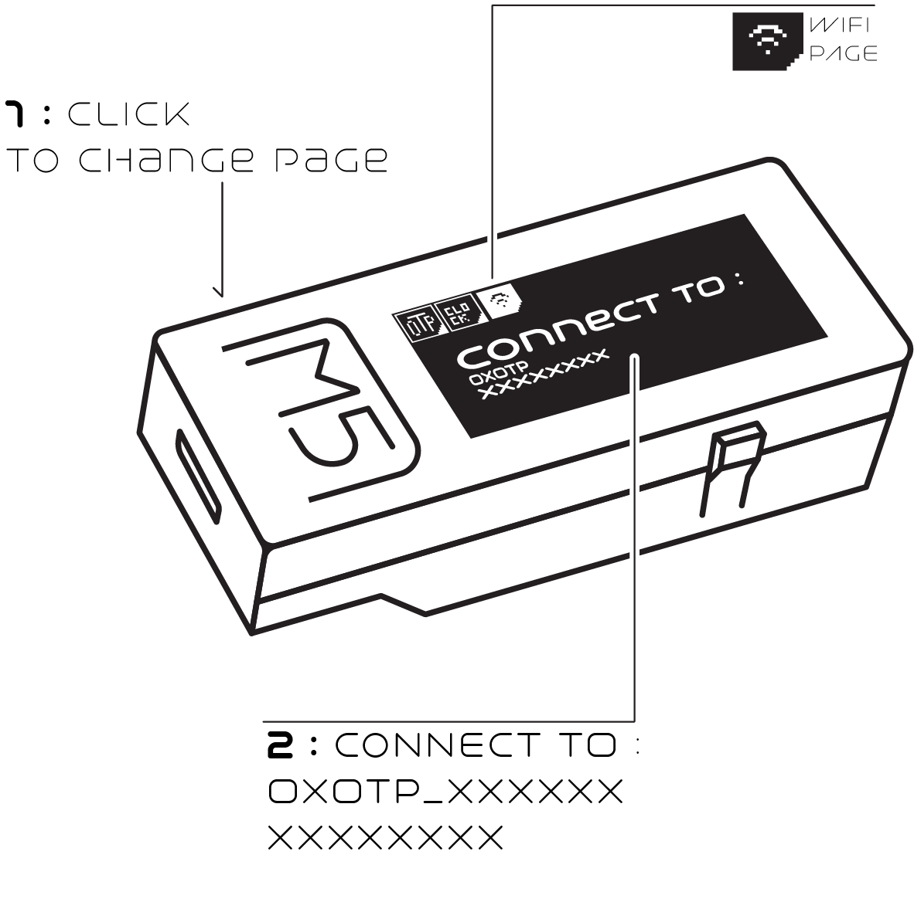
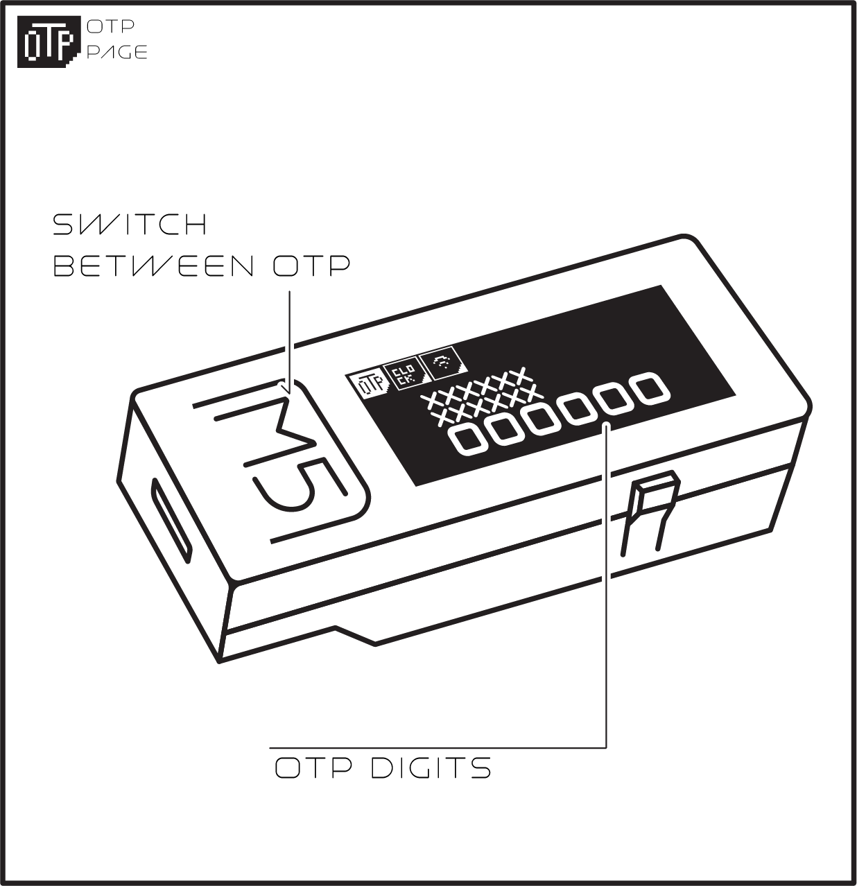
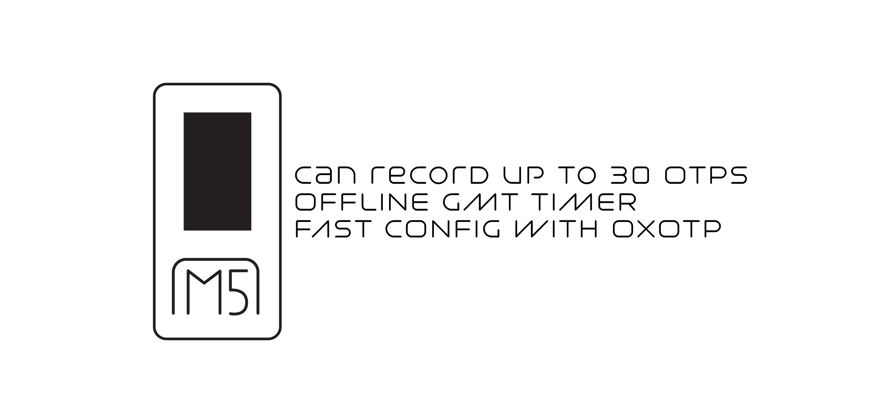
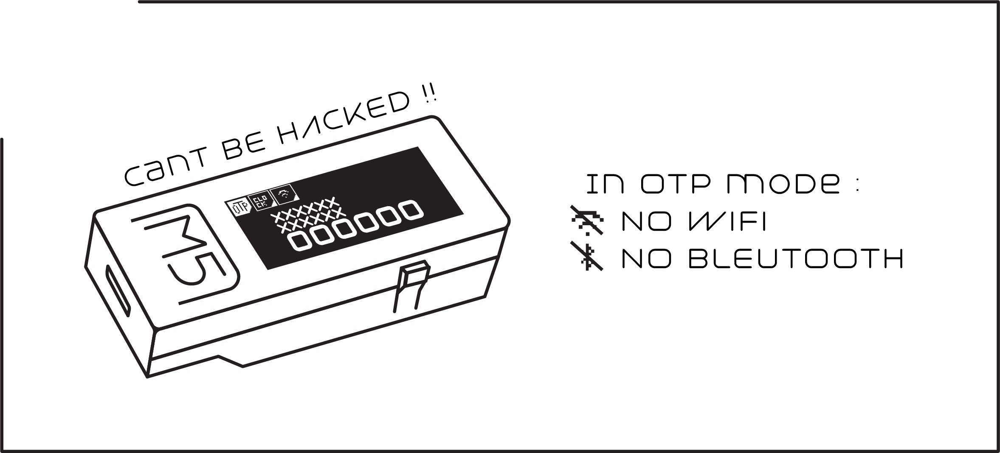

////////////////////////////////////////////////////////////////////////////////////
////////////////////////////////////////////////////////////////////////////////////
# THE NEW VERSION  OF OXOTP is there 
# MADE BY xick 
<a href="https://github.com/xick/OXOTP-plus" target="_blank">https://github.com/xick/OXOTP-plus</a>

# GO CHECK IN HIS REPO 
////////////////////////////////////////////////////////////////////////////////////
////////////////////////////////////////////////////////////////////////////////////

# OXOTP

<b>FIRST OTP BASED ON M5StickC for 2FA   
If you like to support : 

////////////////////////////////////////////////////////////////////////////////////

## [📟 Binaries](https://github.com/IMSHOX/OXOTP/releases/)

## [📱 PLAYSTORE](https://play.google.com/store/apps/details?id=com.shox.oxotp)  

## WHY M5StickC ?
The M5StickC is a compact device with screen, battery and RTC build in with a cheap price.

Less than 10 dollar M5StickC will make huge difference in quality/price with others OTPs to get a secured device for 2FA.

## HOW TO USE

Check how the flash it's done in this section , <a href="HOW.md" target="_blank"> HOW to flash M5StickC</a>

### WIKI

## DEVELOPED FOR DAILY USE

## License 

This software is licensed under the MIT License, to read the full license <a href="LICENSE" target="_blank">HERE</a>.

